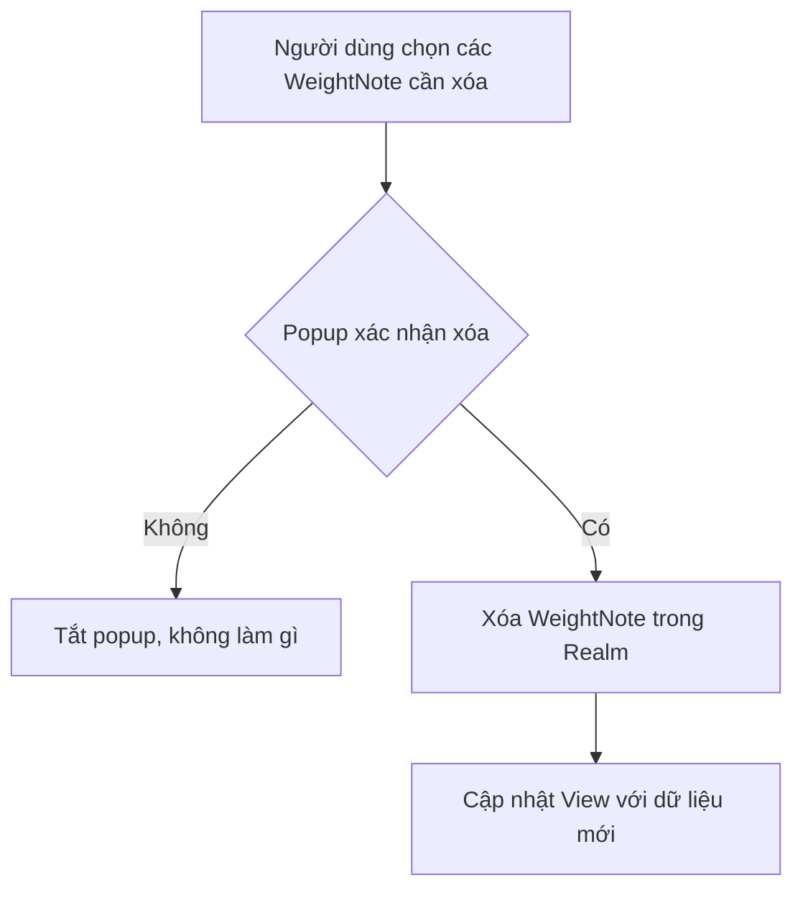
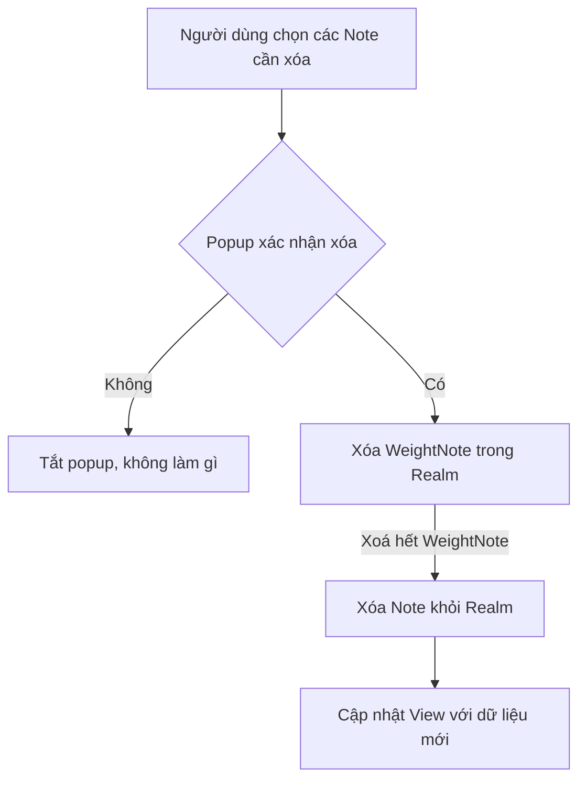
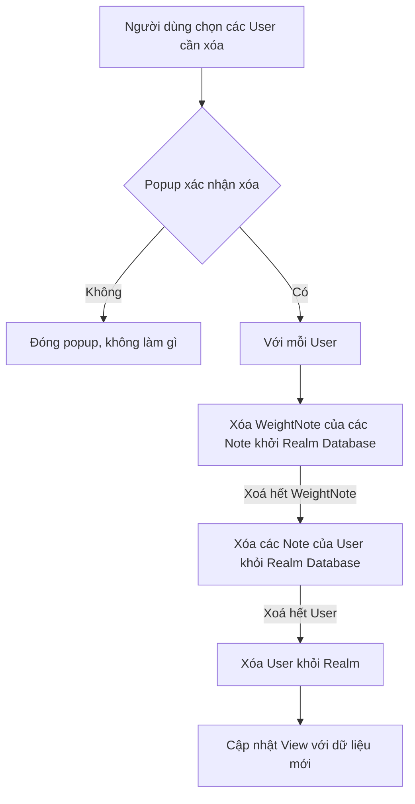
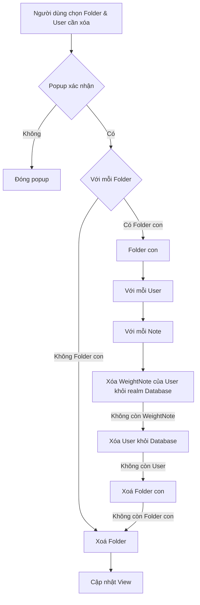

## Delete Weight

## Delete Note

Giải thích:

- A: Người dùng chọn các Note cần xóa
- B: Popup xác nhận xóa hiện ra
    - Nếu chọn Không:
        - C: Tắt popup, không làm gì
    - Nếu chọn Có:
        - D: Xóa WeightNote trong Realm database
        - E: Xóa Note khỏi Realm database
        - F: Cập nhật View với dữ liệu mới

## Delete User

Đây là giải thích chi tiết cho sơ đồ flow đã chỉnh sửa:

- A: Người dùng chọn các User cần xóa
- B: Xuất hiện popup xác nhận việc xóa
    - Nếu chọn Không:
        - C: Đóng popup, không làm gì
    - Nếu chọn Có:
        - D: Lặp qua từng User cần xóa
            - E: Xóa các WeightNote của các Note liên quan khỏi Realm Database
            - F: Xóa các Note liên quan của User khỏi Realm Database
            - G: Xóa User khỏi Realm Database
        - H: Cập nhật View với dữ liệu mới sau khi đã xóa

Như vậy:

- Thêm chi tiết "khỏi Realm Database" ở các bước E, F, G để chỉ rõ các thao tác xóa dữ liệu sẽ trực tiếp trên Realm Database.
- Các bước xử lý vẫn tuân theo nguyên tắc:
  - Xóa chi tiết các thành phần con trước (WeightNote, Note)
  - Sau đó mới xóa đối tượng cha (User)
  - Cuối cùng cập nhật View với dữ liệu mới

Như vậy sơ đồ đã mô tả chi tiết và chính xác quy trình xử lý xóa dữ liệu.

## Delete Folder 

Được, đây là giải thích chi tiết cho sơ đồ flow đã chỉnh sửa:

- A: Người dùng chọn Folder & User cần xóa
- B: Xuất hiện popup xác nhận
- Nếu Không:
  - C: Đóng popup không làm gì
- Nếu Có:
  - D: Với mỗi Folder cần xóa
    - Nếu có Folder con:
      - E: Quay lại xử lý Folder con
    - Nếu không có Folder con:
      - Q: Xóa Folder
  - E: Với mỗi Folder con
    - G: Với mỗi User trong Folder
      - H: Với mỗi Note của User
        - I: Xóa WeightNote khỏi Database
    - J: Xóa User nếu không còn WeightNote
    - P: Xóa Folder con nếu không còn User
  - Q: Xóa Folder nếu không còn Folder con
  - K: Cập nhật View

Như vậy đã mô tả chi tiết luồng xóa theo quan hệ:

- Xóa trước các thành phần con
- Xóa thành phần cha sau khi không còn thành phần con
- Cập nhật View sau cùng
