### 1. Giới thiệu sản phẩm:
- **Tên sản phẩm**: CFarm - Cân lúa
- **Mục tiêu**: Giúp người dùng cân lúa không cần ghi giấy như truyền thống, quá trình tính toán sẽ được tự động, người dùng có thể dể dàng quản lý bản ghi của mình.
- **Người dùng mục tiêu**: Nông dân và tiểu thương

### 2. Đặc tả Thiết kế:
- **Kiểu dáng Thiết kế**: [Bộ Kit Thiết kế Material 3](https://www.figma.com/community/file/1035203688168086460)
- **Bảng màu chính**:
  - Xanh Lúa Non (Wheat Green)
  - Vàng Nông Nghiệp (Farmer's Gold)
- **Logo và Các Nguyên Liệu Hình Ảnh**: [Đang chờ cung cấp...]
- **Kết quả mong muốn**: Dự án trên Figma với việc tích hợp sẵn Bộ Kit Thiết kế Material 3.
### 3. Mô tả chức năng:

### Quản Lý Dữ Liệu:

**Chức năng cơ bản**:
- **Tạo**: Người dùng có thể tạo mới thư mục, người dùng và ghi chú.
- **Xem**: Ứng dụng sẽ hiển thị toàn bộ dữ liệu trên màn hình dưới dạng danh sách. Danh sách sắp xếp theo thời gian
  - Các item và các thông tin hiển thị sẽ được mô tả ở phần Cấu trúc dữ liệu.
- **Sắp xếp**:Người dùng có thể chọn sắp xếp, lọc danh sách kết hợp nhiều thuộc tính của data như thời gian, tổng nợ, khối lượng, tiêu đề, loại data, giao dịch
- **Tìm kiếm**: Nhập kí tự để tìm kiếm và cập nhật danh sách dựa trên kết quả tìm kiếm.
- **Chỉnh sửa**: Cập nhật và chỉnh sửa thông tin cho thư mục, người dùng và ghi chú. Xem chi tiết các thông tin có thể chỉnh sửa ở phần cấu trúc dữ liệu
- **Xóa**: Người dùng có thể xóa một hoặc nhiều mục cùng một lúc.

**Cấu trúc dữ liệu**:
1. **Thư mục (Folder)**:
- Có thể chứa nhiều thư mục con và người dùng. Khi chọn mở thư mục, danh sách sẽ hiển thị các thư mục con và user có trong đó.
- **Thông tin hiển thị**: tiêu đề, tổng khối lượng, tổng tiền, tổng nợ, tổng số mục bên trong, và ngày chỉnh sửa cuối.
- **Thông tin có thể sửa đổi**: tiêu đề
2. **Người dùng (User)**:
- Có thể chứa nhiều ghi chú. Khi chọn mở Người dùng, danh sách sẽ hiển thị các ghị chú của người đó.
- **Thông tin hiển thị**: tên nông dân/tiểu thương, số điện thoại (nếu có), tổng nợ (Nếu có) và ngày chỉnh sửa cuối, tổng giao dịch.
- **Thông tin có thể sửa đổi**: tên nông dân/ tiểu thương và số điện thoại
3. **Ghi chú (Note)**:
- Chứa khối lượng bao mà người dùng nhập. Khi chọn Ghi chú, sẽ hiển thị chi tiết khối lượng và các thông tin tính toán khác (Xem ở Ghi Lúa Chi Tiết - Bảng tổng hợp thông tin gồm).
- **Thông tin hiển thị**: ngày chỉnh sửa cuối, tiêu đề (như "Bán Lúa ST21" hoặc "Mua Lúa ST21"), tổng khối lượng, tổng tiền, tổng số bao, tổng nợ và trạng thái giao dịch.
- **Thông tin có thể sửa đổi**:  tiêu đề, trạng thái giao dịch ,  giá, số tiền đặt cọc, trừ bao

### Ghi Lúa Chi Tiết:

**Chức năng**:
- Cho phép người dùng ghi chi tiết từng bao lúa trong quá trình cân.
- Hệ thống cung cấp một bảng 5x5; mỗi khi người dùng nhập xong chon dấu tiếp tục ở bàn phím, hệ thống tự động chuyển đến ô tiếp theo hoặc Khi một bảng được điền đầy đủ, một bảng mới sẽ xuất hiện và chuyển tiếp đến đó. Nếu người dùng không nhập gì cả chọn nút tiếp thì hệ thống sẽ đóng bàn phím lại (Xem hình ảnh và video đính kèm để hiểu rõ)
- Ở cuối mỗi cột và bảng, có chỉ số hiển thị tổng của cột hoặc bảng đó. Sau mỗi 3 bảng, có một cột tổng của trang. (Như vậy sau khi cân dò lại các mã sẽ dể tìm ra chỗ ghi sai)
- Bảng tổng hợp thông tin gồm: khối lượng, tổng bao, trừ bì, khối lượng bao, khối lượng thực, giá thu mua, thành tiền, đặt cọc, đã trả, số tiền còn lại và trạng thái mua/bán.
- Trong chế độ xem, người dùng chỉ có thể thay đổi giá, đặt cọc, trừ bao và trạng thái mua/bán.
- Trong chế độ edit mode người dùng có thể thêm xoá bao và chỉnh sửa các trường: tiêu đề, trạng thái mua/bán ,  giá, số tiền đặt cọc, trừ bao

### 4. Luồng công việc (User Flow):

#### 4.1 Quản lý bản ghi

##### 4.1.1 Xem

1. Xem danh sách Folder, User, Note

###### User Flow

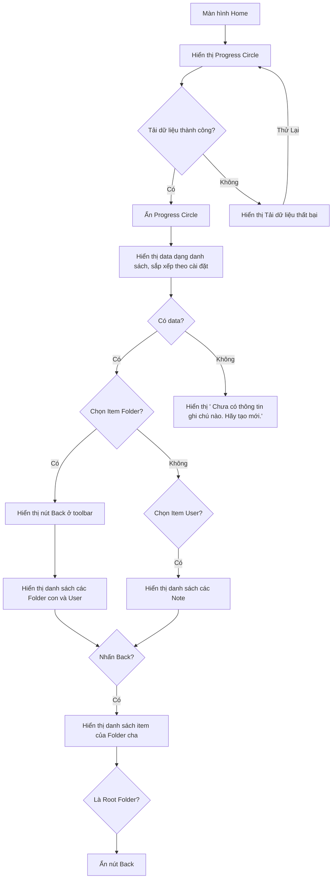

###### Process Flow

  - **Bắt đầu**: Màn hình Home.
  - **Quy trình cơ bản**:
    - 1 Hệ thống:
       - 1.1 Tải dữ liệu
         - 1.1.1 Hiển thị Progress Circle
       - 1.2 Khi tải dữ liệu thành công 
         - 1.2.1 Ẩn Progress Circle
         - 1.2.2 Hiển thị tất cả data dạng danh sách, sắp xếp theo cài đặt 4.1.2 - Sắp xếp
    - 2 Người dùng
      - 2.1 Chọn Item Folder 
    - 3 Hệ thống: 
      - 3.1 Hiển thị nút Back ở toolbar.
      - 3.2 Hiển thị danh sách các Folder con và User. Sắp xếp theo cài đặt 4.1.2 - Sắp xếp
        (Thông tin hiển thị ở phần Cấu Trúc Dữ Liệu - Thông tin hiển thị)
  - **Các trường hợp ngoại lệ**:
    - 1.2.2.a Hệ thống: 
      - Khi không có data, hiển thị hình ảnh và dòng text thay cho danh sách. 
        - Dòng text "Chưa có thông tin ghi chú nào. Hãy tạo mới." [Tham khảo Hình 1]
    - 1.2.a Hệ thống:
      - Khi tải dữ liệu thất bại
      - Hiển thị hình ảnh, dòng text, nút button thay cho danh sách.
        - Dòng text "Tải dữ liệu thất bại" [Tham khảo Hình 1]
        - Nút button "Thử lại"
          - Người dùng: Chọn nút button -> Quay lại bước 1.1
    - 3.2.a Hệ thống:
      - Khi không có data:
        - Hiển thị hình ảnh và dòng text thay cho danh sách.
          - Dòng text "Chưa có thông tin ghi chú nào. Hãy tạo mới." [Hình 1]
    - 2.1.a Người dùng:
      - Chọn Item User
          - Hệ thống: Hiển thị nút Back ở toolbar.
          - Hệ thống: Hiển thị danh sách các Note (Thông tin hiển thị ở phần Cấu Trúc Dữ Liệu - Thông tin hiển thị).  Sắp xếp theo cài đặt 4.1.2 - Sắp xếp
    - 3.1.a Người dùng:
      - Chọn Back
          - Hệ thống: 
            - Hiển thị danh sách các item của Folder cha. Sắp xếp theo cài đặt 4.1.2 - Sắp xếp
            - Nếu là Root Folder.
                - Ẩn nút Back.

###### User Flow

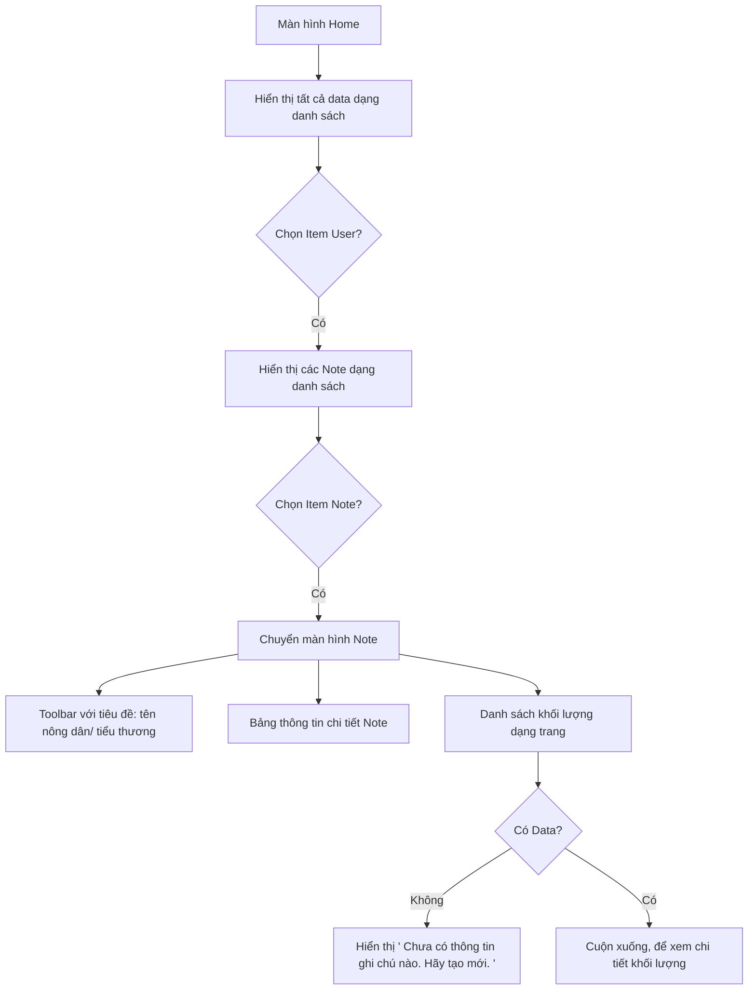

###### Process Flow

2. Xem chi tiết Note

- **Bắt đầu**: Màn hình Home.
- **Quy trình cơ bản**:
  - 1 Hệ thống: Hiển thị tất cả data dạng danh sách
  - 2 Người dùng: 
    - 2.1 Chọn Item User
    - 2.2 Hệ thống: Hiển thị các Note dạng danh sách
    - 2.3 Người dùng: Chọn Item Note
  - 3 Hệ thống: Chuyển màn hình Note
    - 3.1 Toolbar với tiêu đề: tên nông dân/ tiểu thương
    - 3.2 Một bảng thông tin
      - 3.2.1 Thời gian
      - 3.2.2 Trạng thái giao dịch (Mua hoặc Bán)
      - 3.2.3 Tên Note
      - 3.2.4 Khối lượng: Đơn vị Kg
      - 3.2.5 Tổng bao: Đơn vị bao
      - 3.2.6 Trừ bì: Đơn vị Bao/Kg
      - 3.2.7 Khối lượng bao: Đơn vị Kg
      - 3.2.8 Khối lượng thực: Đơn vị Kg
      - 3.2.9 Giá thu mua: Đơn vị đ 
      - 3.2.10 Thành tiền: Đơn vị đ
      - 3.2.11 Đặt cọc: Đơn vị đ
      - 3.2.12 Đã trả: Đơn vị đ
      - 3.2.13 Còn lại: Đơn vị đ
    - 3.3 Danh sách khối lượng dạng trang
      - 3.3.1 Trang
        - 3.3.1.1 Số thứ tự trang: (Trang 1..n)
        - 3.3.1.2 Tổng khối lượng trang: đơn vị Kg
        - 3.3.1.3 Có 3 Bảng
          - 3.3.1.3.1 Bảng
            - 3.3.1.3.1.1 Số thứ tự bảng: (Bảng 1..n)
            - 3.3.1.3.1.2 Tổng khối lượng bảng: đơn vị Kg
            - 3.3.1.3.1.3 Có 5 cột
              - 3.3.1.3.1.3 Cột
                - 3.3.1.3.1.3.1 Số thứ tự cột: (Cột 1..n)
                - 3.3.1.3.1.3.2 Tổng khối lượng cột: đơn vị Kg
                - 3.3.1.3.1.3.3 Có 5 dòng
                  - 3.3.1.3.1.3.3 dòng
                    - 3.3.1.3.1.3.3.1 Text: Chỉ số khối lượng
  - 4 Người dùng: Cuộn xuống, để xem chi tiết khối lượng.

- **Các trường hợp ngoại lệ**:
  - 3.3.a Hệ thống không có Data
    - Khi không có data, hiển thị hình ảnh và dòng text thay cho danh sách.
      - Dòng text "Chưa có thông tin ghi chú nào. Hãy tạo mới." [Tham khảo Hình 1]

##### 4.1.2 Sắp xếp

###### User Flow

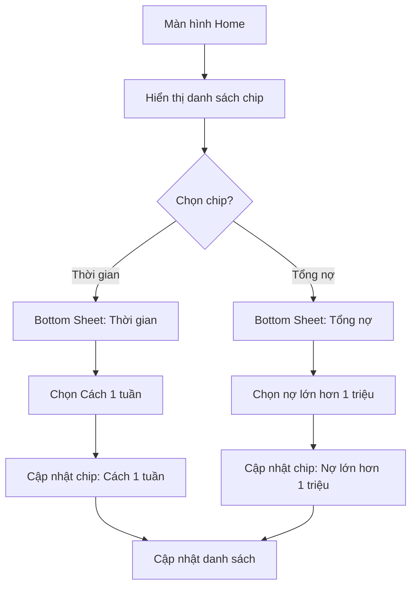

###### Process Flow

- **Bắt đầu**: Màn hình Home.
- **Quy trình cơ bản**:
  - 1 Hệ thống:
    - 1.1 Hiển thị danh sách [chip theo hàng ngang](https://m3.material.io/components/chips/guidelines#96b78af6-fb40-47fd-9c51-1496251f3378)
      - 1.1.1 Danh sách gồm: Thời gian, tổng nợ, khối lượng, tiêu đề, loại data, giao dịch
  - 2 Người dùng: Chọn chip thời gian
  - 3 Hệ thống:
    - 3.1 Hiển thị Bottom Sheet chứa tiêu đề và một danh sách gồm radio button và text:
      - 3.1.1 Tiêu đề: Thời gian
      - 3.1.2 Danh sách: Thời gian tăng dần, Thời gian giảm dần, Cách 1 tuần, Cách 1 Tháng, Cách 3 Tháng, Cách 6 Tháng, Cách 1 Năm.
  - 4 Người dùng: Chọn Cách 1 tuần
  - 5 Hệ thống:
    - 5.1 Cập nhật chip thời gian thành Cách 1 tuần
    - 5.2 Cập nhật danh sách (data) hiển thị.
- **Các trường hợp ngoại lệ**:
  - 2.a Người dùng: Chọn chip tổng nợ
    - 3.1.1 Tiêu đề: Tổng nợ
    - 3.1.2 Danh sách: Tổng nợ tăng dần, Tổng nợ giảm dần, Nợ trên 1 triệu, Nợ trên 10 triệu, Nợ trên 100 triêu, Nợ trên 1 tỷ.
  - 2.b Người dùng: Chọn chip giao dịch
    - 3.1.1 Tiêu đề: Giao dịch
    - 3.1.2 Danh sách: Tất cả, Mua, Bán
    - 4 Người dùng: Chọn Mua
    - 5 Hệ thống:
      - 5.1 Cập nhật chip giao dịch thành Mua
      - 5.2 Cập nhật danh sách Hiển thị.
    - 2 Người dùng: Chọn chip Mua
      - 3.1.1 Tiêu đề: Giao dịch
      - 3.1.2 Danh sách: Tất cả, Mua, Bán
      - 4 Người dùng: Chọn Tất cả
      - 5 Hệ thống:
        - 5.1 Cập nhật chip Mua thành Giao Dịch
        - 5.2 Cập nhật danh sách hiển thị.

##### 4.1.2 Tạo

###### User Flow

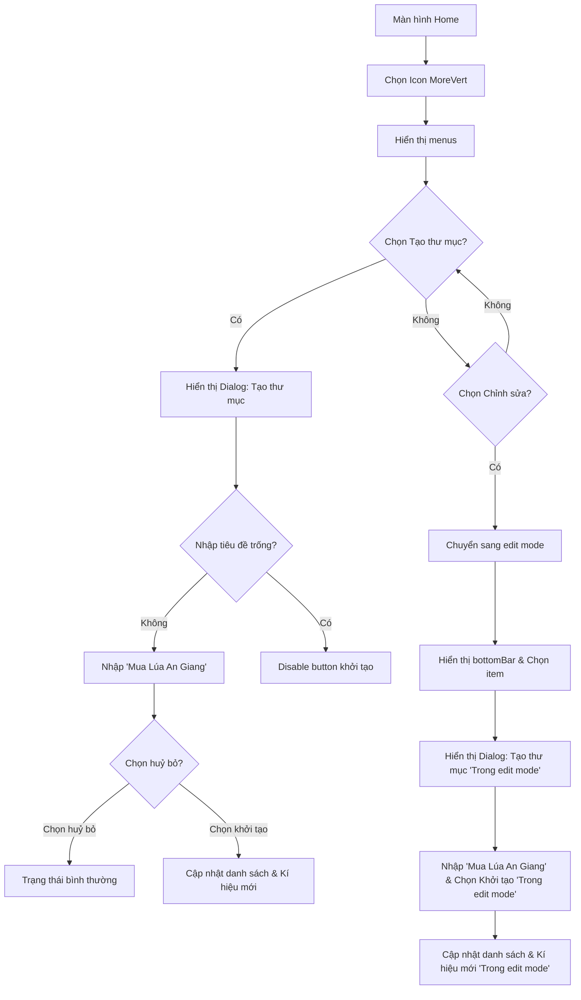

###### Process Flow

1. **Tạo Folder**
- **Bắt đầu**: Màn hình Home.
- **Quy trình cơ bản**:
  - 1 Người dùng: Chọn Icon MoreVert trên toolbar
  - 2 Hệ thống: Hiển thị menus: Chỉnh sửa, Tạo thư mục, Tạo danh bạ, Thùng rác.
  - 3 Người dùng: Chọn Tạo thư mục
  - 4 Hệ thống:
    - 4.1 Hiển thị Dialog:
      - 4.1.1 Tiêu đề: Tạo thư mục
      - 4.1.2 TextField: Thư mục A
      - 4.1.3 2 Nút button:
        - Huỷ bỏ và Khởi tạo.
  - 5 Người dùng:
    - 5.1 Nhập "Mua Lúa An Giang"
    - 5.2 Chọn Khởi tạo
  - 6 Hệ Thống: 
    - 6.1 Ẩn Dialog
    - 6.2 Cập nhật danh sách
    - 6.3 Item sẽ được kí hiệu mới (Tham khảo hình 3)
- **Các trường hợp ngoại lệ**:
  - 1.a Người dùng: Chọn Icon MoreVert trên toolbar
    - 2 Hệ thống: Hiển thị menus: Chỉnh sửa, Tạo thư mục, Tạo danh bạ, Thùng rác.
    - 3 Người dùng: Chỉnh sửa
    - 4 Hệ thống: Chuyển sang edit mode
      - Xuất hiện checkbox trên mỗi item
      - Xuất hiện checkbox và dòng text trên đầu danh sách:
        - Dòng text: Chọn tất cả
    - 5 Người dùng: Chọn item 
      - Hệ thống:
        - Tiêu đề trên toolbar chuyển thành: số item được chọn
        - Hiển thị bottomBar: Gồm Icon và Text
          - Danh sách gồm: Tạo thư mục, di chuyển, sao chép, xoá, khác (sử dụng Icon moreVert)
      - Người dùng: Chọn icon bottomBar Tạo thư mục
    - 6 Hệ thống:
      - Hiển thị Dialog:
        - Tiêu đề: Tạo thư mục
        - TextField: Thư mục A
        - 2 Nút button:
          - Huỷ bỏ và Khởi tạo.
      - Người dùng:
        - Nhập "Mua Lúa An Giang"
        - Chọn Khởi tạo
      - Hệ Thống:
        - Ẩn Dialog
        - Chuyển về dạng view Mode
        - Cập nhật danh sách
        - Item vừa được khởi tạo sẽ được kí hiệu mới (Tham khảo hình 3)        
  - 5.2.a Chọn huỷ bỏ
    - Không làm gì cả. Trở lại trạng thái bình thường.
  - 5.1.a Nhập tiêu đề trống
       - Hệ thống disable button khởi tạo

###### User Flow

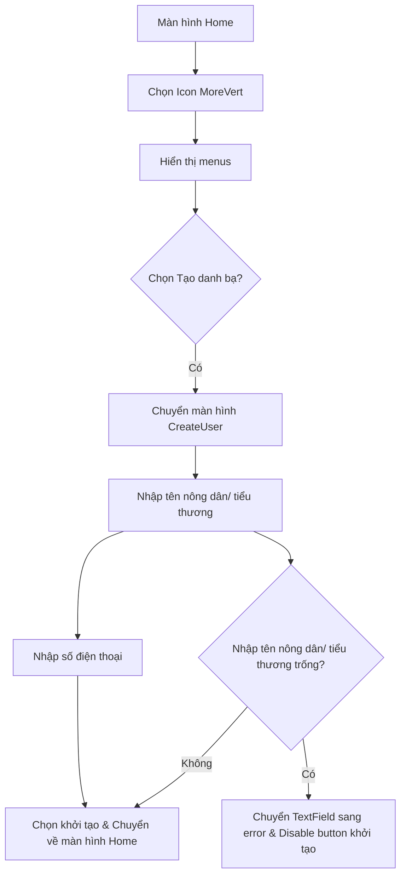

###### Process Flow

2. **Tạo User**
- **Bắt đầu**: Màn hình Home.
- **Quy trình cơ bản**:
  - 1 Người dùng: Chọn Icon MoreVert trên toolbar
  - 2 Hệ thống: Hiển thị menus: Chỉnh sửa, Tạo thư mục, Tạo danh bạ, Thùng rác.
  - 3 Người dùng: Chọn tạo danh bạ
  - 2 Hệ thống: Chuyển màn hình CreateUser
    - 2.1 Toolbar: Hiện tạo Danh bạ
    - 2.2 TextField: Tên 
    - 2.3 TextField: Số diện thoại
    - 2.4 Button: Khởi tạo
  - 3 Người dùng: Nhập tên nông dân/ tiểu thương (Bắt buộc)
  - 4 Người dùng: Nhập số điện thoại (Tùy chọn)
  - 5 Người dùng: Chọn khởi tạo -> Chuyển về màn hình Home.
- **Các trường hợp ngoại lệ**:
  - 3.a Người dùng: 
    - Nhập tên nông dân/ tiểu thương trống
    - Chuyển sang TextField tiếp theo
    - Hệ Thống:
      - Chuyển textField sang error, với text "Tên người dùng không được nhập trống"
      - Disable button khởi tạo

###### User Flow

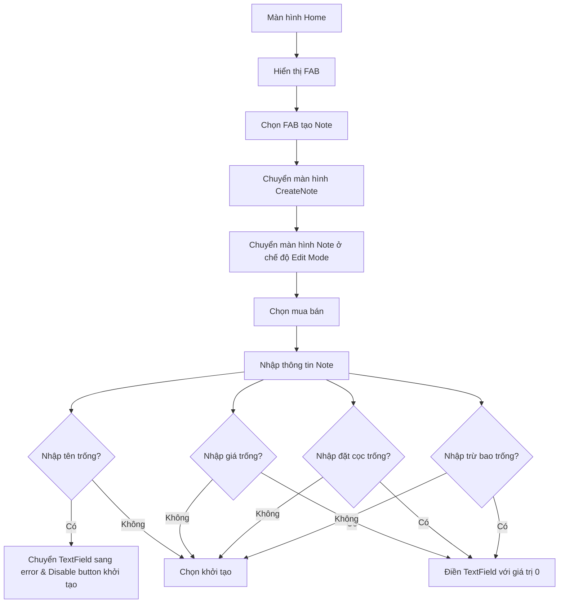

###### Process Flow

3. **Tạo Note**
- **Bắt đầu**: Màn hình Home.
- **Quy trình cơ bản**:
  - 1 Hệ thống: Hiển thị FAB
  - 2 Người dùng: chọn FAB tạo Note.
  - 3.1 Chuyển màn hình CreateNote.
    - 3.1 Radio button:
      - 3.1.1 Radio button: Mua (mặc định được chọn)
      - 3.1.2 Radio button: Bán
    - 3.2 TextField:
      - 3.2.1 Text Tên
      - 3.2.2 Leading Icon (Hình cây lúa)
    - 3.3 TextField:
      - 3.3.1 Text Giá 
      - 3.3.2 Trailing Icon (đ)
    - 3.4 TextField:
      - 3.4.1 Text Đặt Cọc
      - 3.4.2 Trailing Icon (đ)
    - 3.5 TextField:
      - 3.5.1 Text Trừ bao với giá trị mặc định 8
      - 3.5.2 Trailing Icon Bao/Kg
    - 3.6 Button: Khởi tạo
  - 4 Người dùng:
    - 4.1 Chọn trạng thái mua hoặc bán.
    - 4.2 Nhập tên "Lúa OM35"
    - 4.3 Nhập giá "3.500"
    - 4.4 Nhập đặt cọc "2.000.000"
    - 4.5 Nhập trừ bao "10"
  - 5 Chọn khởi tạo. -> Chuyển màn hình Note ở chế độ Edit Mode.

- **Các trường hợp ngoại lệ**:
  - 4.2.a Người dùng:
    - Nhập tên trống
    - Chuyển sang TextField tiếp theo
    - Hệ Thống:
      - Chuyển textField sang error, với text "Tên người dùng không được nhập trống"
      - Disable button khởi tạo
  - 4.3.a Người dùng:
    - Nhập tên trống
    - Chuyển sang TextField tiếp theo
    - Hệ Thống:
      - Điền TextField với giá trị 0 
  - 4.4.a Người dùng:
    - Nhập đặt cọc trống
    - Chuyển sang TextField tiếp theo
    - Hệ Thống:
      - Điền TextField với giá trị 0
  - 4.5.a Người dùng:
    - Nhập trừ bao cọc trống
    - Chuyển sang TextField tiếp theo
    - Hệ Thống:
      - Điền TextField với giá trị 0

- **Yêu cầu đặc biệt**:
  - Chức năng tạo Note sẽ được sử dụng thường xuyên hơn nên hãy design nó chỗ dể thấy và dễ sử dụng nhất.
  - Khi ở View Mode FAB sẽ xuất hiện
  - Khi ở Edit Mode FAB sẽ ẩn đi

##### 4.1.3 Tìm kiếm

###### User Flow

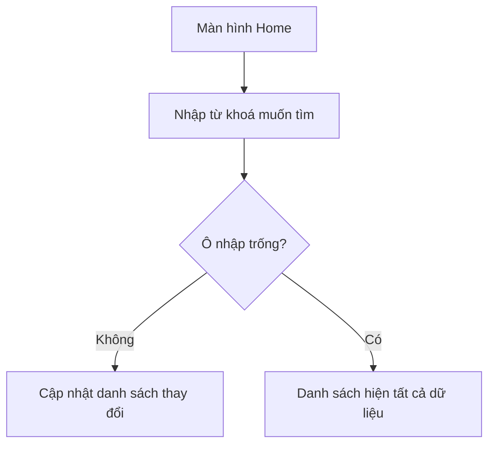

###### Process Flow

- **Bắt đầu**: Màn hình Home.
- **Quy trình cơ bản**:
  - 1 Người dùng: 
    - 1.1 Chọn Icon Search ở Toolbar
    - 1.2 Nhập từ khoá muốn tìm
  - 2 Hệ thống: Cập nhật danh sách thay đổi
- **Các trường hợp ngoại lệ**:
  - 1.2.a Ô nhập trống
    - 2 Danh sách hiện tất cả dữ liệu.

##### 4.1.4 Chỉnh sửa

###### User Flow

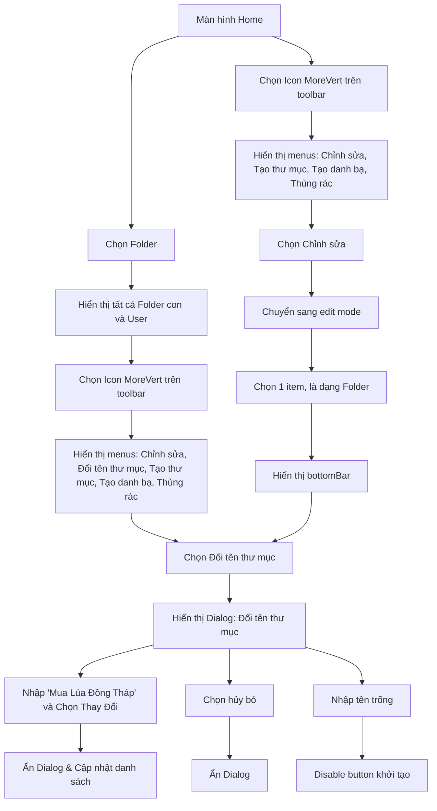

###### Process Flow

1. **Chỉnh sửa Folder**
- **Bắt đầu**: Màn hình Home.
- **Quy trình cơ bản**:
  - 1 Người dùng: Chọn Folder
  - 2 Hệ thống: Hiển thị tất cả Folder con và User
  - 3 Người dùng: Chọn Icon MoreVert trên toolbar
  - 4 Hệ thống: Hiển thị menus: Chỉnh sửa, Đổi tên thư mục, Tạo thư mục, Tạo danh bạ, Thùng rác.
  - 5 Người dùng: Chọn Đổi tên thư mục
  - 6 Hệ thống: 
    - 6.1 Hiển thị Dialog:
      - 6.1.1 Tiêu đề: Đổi tên thư mục
      - 6.1.2 TextField: Mua Lúa An Giang
      - 6.1.3 2 Nút button:
        - Huỷ bỏ và Thay Đổi.
  - 7 Người dùng:
    - 7.1 Nhập "Mua Lúa Đồng Tháp"
    - 7.2 Chọn Thay Đổi
  - 8 Hệ thống:
    - 8.1 Ẩn Dialog
    - 8.2 Cập nhật danh sách
    - 8.3 Item sẽ được kí hiệu mới (Tham khảo hình 3)
- **Các trường hợp ngoại lệ**:
  - 7.2.a Chọn hủy bỏ
    - Không làm gì cả. Trở lại trạng thái bình thường.
  - 7.1.a Người dùng:
    - Nhập tên trống
    - Hệ Thống:
      - Disable button khởi tạo
  - 1.a Người dùng: Chọn Icon MoreVert trên toolbar
    - Hệ thống: Hiển thị menus: Chỉnh sửa, Tạo thư mục, Tạo danh bạ, Thùng rác.
    - Người dùng: Chỉnh sửa
    - Hệ thống: Chuyển sang edit mode
      - Xuất hiện checkbox trên mỗi item
      - Xuất hiện checkbox và dòng text trên đầu danh sách:
        - Dòng text: Chọn tất cả
    - Người dùng: Chọn 1 item, là dạng Folder
    - Hệ thống:
      - Tiêu đề trên toolbar chuyển thành: số item được chọn
      - Hiển thị bottomBar: Gồm Icon và Text
        - Danh sách gồm: Tạo thư mục, đôi tên, di chuyển, sao chép, xoá, khác (sử dụng Icon moreVert)
    - Người dùng: Chọn Đổi tên thư mục
    - Tiếp tục bước 6.

###### User Flow

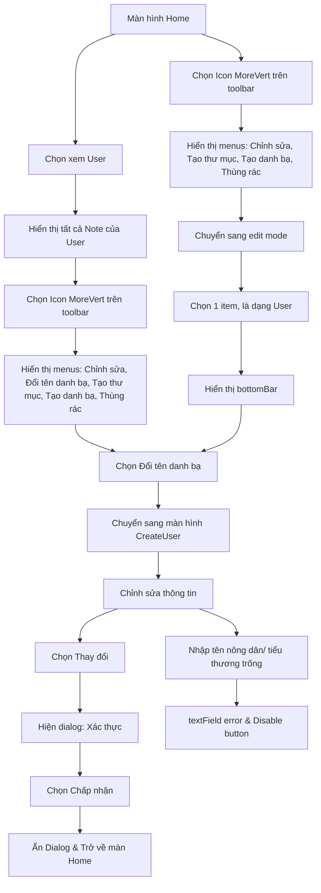

###### Process Flow

2. **Chỉnh sửa User**
- **Bắt đầu**: Màn hình Home.
- **Quy trình cơ bản**:
  - 1 Người dùng: Chọn xem User
  - 2 Hệ thống: Hiển thị tất cả Note của User.
  - 3 Người dùng: Chọn Icon MoreVert trên toolbar
  - 4 Hệ thống: Hiển thị menus: Chỉnh sửa, Đổi tên danh bạ, Tạo thư mục, Tạo danh bạ, Thùng rác.
  - 5 Người dùng: Chọn Đổi tên danh bạ
  - 6 Hệ thống: Chuyển sang màn hình CreateUser
    - 6.1 Toolbar: Hiện tạo Danh bạ
    - 6.2 TextField: Tên
    - 6.3 TextField: Số diện thoại
    - 6.4 Button: Thay đổi
  - 7 Người dùng: Chỉnh sửa thông tin
  - 8 Người dùng: Chọn Thay đổi.
  - 9 Hệ thống: Hiện dialog
    - 9.1 Tiêu đề: Xác thực
    - 9.2 Nội dung: Bạn có thực sử muốn thay đổi
    - 9.3 2 Nút button: Huỷ - Chấp nhận
  - 10 Người dùng: Chọn Chấp nhận
  - 11 Hệ thống:
    - 11.1 Ẩn Dialog
    - 11.2 Trở về màn Home
- **Các trường hợp ngoại lệ**:
  - 1.a Người dùng: Chọn Icon MoreVert trên toolbar
    - Hệ thống: Hiển thị menus: Chỉnh sửa, Tạo thư mục, Tạo danh bạ, Thùng rác.
    - Người dùng: Chỉnh sửa
    - Hệ thống: Chuyển sang edit mode
      - Xuất hiện checkbox trên mỗi item
      - Xuất hiện checkbox và dòng text trên đầu danh sách:
        - Dòng text: Chọn tất cả
    - Người dùng: Chọn 1 item, là dạng User
    - Hệ thống:
      - Tiêu đề trên toolbar chuyển thành: số item được chọn
      - Hiển thị bottomBar: Gồm Icon và Text
        - Danh sách gồm: Tạo thư mục, Chỉnh sửa danh bạ, di chuyển, sao chép, xoá, khác (sử dụng Icon moreVert)
    - Người dùng: Chọn Chỉnh sửa danh bạ
    - Tiếp tục bước 6.

  - 7.a Người dùng:
    - Nhập tên nông dân/ tiểu thương trống
    - Chuyển sang TextField tiếp theo
    - Hệ Thống:
      - Chuyển textField sang error, với text "Tên người dùng không được nhập trống"
      - Disable button khởi tạo

###### User Flow

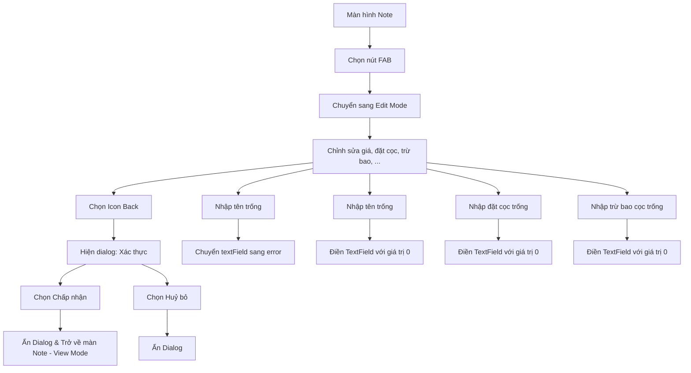

###### Process Flow

3. **Chỉnh sửa Note**
- **Bắt đầu**: Màn hình Note.
- **Quy trình cơ bản**:
  - 1 Người dùng: Chọn nút FAB
  - 2 Hệ thống: Chuyển sang Edit Mode
    - 2.1 Bảng Thông Tin
      - 2.1.1 Thời gian
      - 2.1.2 Radio Button: Trạng thái giao dịch (Mua hoặc Bán)
      - 2.1.3 Tên Note
      - 2.1.4 Khối lượng: Đơn vị Kg
      - 2.1.5 Tổng bao: Đơn vị bao
      - 2.1.6 TextFiled Trừ bì: Đơn vị Bao/Kg
      - 2.1.7 Khối lượng bao: Đơn vị Kg
      - 2.1.8 Khối lượng thực: Đơn vị Kg
      - 2.1.9 TextFiled Giá thu mua: Đơn vị đ
      - 2.1.10 Thành tiền: Đơn vị đ
      - 2.1.11 TextFiled Đặt cọc: Đơn vị đ
      - 2.1.12 Đã trả: Đơn vị đ
      - 2.1.13 Còn lại: Đơn vị đ
    - 2.2 Danh sách trang tính
      - 2.2.1 Trang
      - 2.2.1.1 Số thứ tự trang: (Trang 1..n)
      - 2.2.1.2 Tổng khối lượng trang: đơn vị Kg
      - 2.2.1.3 Có 3 Bảng
        - 2.2.1.3.1 Bảng
          - 2.2.1.3.1.1 Số thứ tự bảng: (Bảng 1..n)
          - 2.2.1.3.1.2 Tổng khối lượng bảng: đơn vị Kg
          - 2.2.1.3.1.3 Có 5 cột
            - 2.2.1.3.1.3 Cột
              - 2.2.1.3.1.3.1 Số thứ tự cột: (Cột 1..n)
              - 2.2.1.3.1.3.2 Tổng khối lượng cột: đơn vị Kg
              - 2.2.1.3.1.3.3 Có 5 dòng
                - 2.2.1.3.1.3.3 dòng
                  - 2.2.1.3.1.3.3.1 Text: Chỉ số khối lượng
    - 2.3 Ẩn nút FAB
    - 2.4 Hiển thị Icon Back trên Toolbar
  - 3 Người dùng: Chỉnh sửa giá, đặt cọc, trừ bao, trạng thái giao dịch (Mua hoặc Bán), chỉnh sửa khối lượng từng bao, thêm bao...
  - 4 Người dùng: Chọn Icon Back
  - 5 Hệ thống: Hiện dialog
    - 5.1 Tiêu đề: Xác thực
    - 5.2 Nội dung: Bạn có thực sử muốn thay đổi
    - 5.3 2 Nút button: Huỷ - Chấp nhận
  - 6 Người dùng: Chọn Chấp nhận
  - 7 Hệ thống:
    - 7.1 Ẩn Dialog
    - 7.2 Trở về màn Note - View Mode
    - 7.3 Hiển thị FAB.
- **Các trường hợp ngoại lệ**:
  - 3.a Người dùng:
    - Nhập tên trống
    - Chuyển sang TextField tiếp theo
    - Hệ Thống:
      - Chuyển textField sang error, với text "Tên người dùng không được nhập trống"
      - Disable button khởi tạo
  - 3.b Người dùng:
    - Nhập tên trống
    - Chuyển sang TextField tiếp theo
    - Hệ Thống:
      - Điền TextField với giá trị 0
  - 3.c Người dùng:
    - Nhập đặt cọc trống
    - Chuyển sang TextField tiếp theo
    - Hệ Thống:
      - Điền TextField với giá trị 0
  - 3.d Người dùng:
    - Nhập trừ bao cọc trống
    - Chuyển sang TextField tiếp theo
    - Hệ Thống:
      - Điền TextField với giá trị 0
  - 6.a Người dùng: Chọn Huỷ bỏ
    - Hệ thống: Ẩn Dialog

###### User Flow

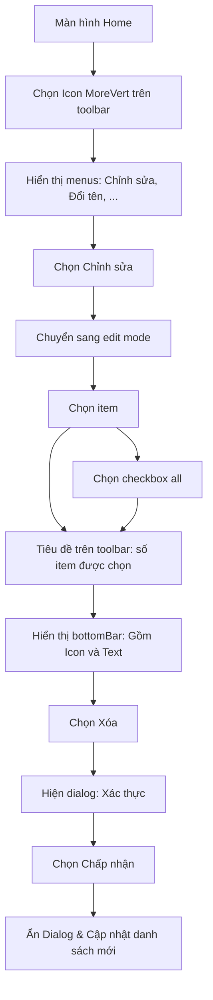

###### Process Flow

##### 4.1.5 Xóa

- **Bắt đầu**: Màn hình Home.
- **Quy trình cơ bản**:
  - 1 Người dùng: Chọn Icon MoreVert trên toolbar
  - 2 Hệ thống: Hiển thị menus: Chỉnh sửa, Đổi tên thư mục, Tạo thư mục, Tạo danh bạ, Thùng rác.
  - 3 Người dùng: Chỉnh sửa
  - 4 Hệ thống: Chuyển sang edit mode
    - 4.1 Xuất hiện checkbox trên mỗi item
    - 4.2 Xuất hiện checkbox và dòng text trên đầu danh sách:
      - 4.3 Dòng text: Chọn tất cả
  - 5 Người dùng: Chọn item
  - 6 Hệ thống:
    - 6.1 Tiêu đề trên toolbar chuyển thành: số item được chọn
    - 6.2 Hiển thị bottomBar: Gồm Icon và Text
      - Danh sách gồm: Tạo thư mục, đôi tên, di chuyển, sao chép, xoá, khác (sử dụng Icon moreVert)
  - 7 Người dùng: Chọn Xóa
  - 8 Hệ thống: Hiện dialog
    - 8.1 Tiêu đề: Xác thực
    - 8.2 Nội dung: Bạn có thực sử muốn thay đổi
    - 8.3 2 Nút button: Huỷ - Chấp nhận
  - 8 Người dùng: Chọn Chấp nhận
  - 9 Hệ thống:
    - Ẩn Dialog
    - Cập nhật danh sách mới
- **Các trường hợp ngoại lệ**:
  - 5.a Người dùng: Chọn checkbox all. Hệ thống sẽ chọn hết các item

###### User Flow

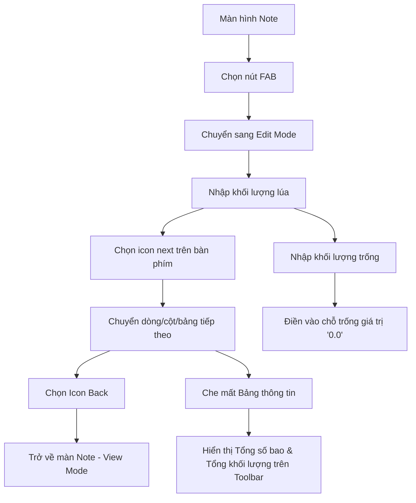

###### Process Flow

#### 4.2 Ghi lúa chi tiết
- **Bắt đầu**: Màn hình Note.
- **Quy trình cơ bản**:
  - 1 Người dùng: Chọn nút FAB
  - 2 Hệ thống: Chuyển sang Edit Mode
    - 2.1 Bảng Thông Tin
      - 2.1.1 Thời gian
      - 2.1.2 Radio Button: Trạng thái giao dịch (Mua hoặc Bán)
      - 2.1.3 Tên Note
      - 2.1.4 Khối lượng: Đơn vị Kg
      - 2.1.5 Tổng bao: Đơn vị bao
      - 2.1.6 TextFiled Trừ bì: Đơn vị Bao/Kg
      - 2.1.7 Khối lượng bao: Đơn vị Kg
      - 2.1.8 Khối lượng thực: Đơn vị Kg
      - 2.1.9 TextFiled Giá thu mua: Đơn vị đ
      - 2.1.10 Thành tiền: Đơn vị đ
      - 2.1.11 TextFiled Đặt cọc: Đơn vị đ
      - 2.1.12 Đã trả: Đơn vị đ
      - 2.1.13 Còn lại: Đơn vị đ
    - 2.2 Danh sách trang tính
      - 2.2.1 Trang
      - 2.2.1.1 Số thứ tự trang: (Trang 1..n)
      - 2.2.1.2 Tổng khối lượng trang: đơn vị Kg
      - 2.2.1.3 Có 3 Bảng
        - 2.2.1.3.1 Bảng
          - 2.2.1.3.1.1 Số thứ tự bảng: (Bảng 1..n)
          - 2.2.1.3.1.2 Tổng khối lượng bảng: đơn vị Kg
          - 2.2.1.3.1.3 Có 5 cột
            - 2.2.1.3.1.3 Cột
              - 2.2.1.3.1.3.1 Số thứ tự cột: (Cột 1..n)
              - 2.2.1.3.1.3.2 Tổng khối lượng cột: đơn vị Kg
              - 2.2.1.3.1.3.3 Có 5 dòng
                - 2.2.1.3.1.3.3 dòng
                  - 2.2.1.3.1.3.3.1 Text: Chỉ số khối lượng
    - 2.3 Ẩn nút FAB
    - 2.4 Hiển thị Icon Back trên Toolbar
  - 3 Người dùng: 
    - 3.1 Nhập khối lượng lúa
    - 3.2 Chọn icon next trên bàn phím
  - 4 Hệ thống:
    - 4.1 Chuyển sang dòng tiếp theo
    - 4.2 Chuyển sang cột tiếp theo nếu cột đầy đủ
    - 4.3 Chuyển sang bảng tiếp theo nếu bảng đầy đủ
  - 5 Người dùng: Chọn Icon Back
  - 6 Hệ thống:
    - 6.1 Trở về màn Note - View Mode
    - 6.2 Hiển thị FAB.
- **Các trường hợp ngoại lệ**: 
  - 3.1.a Người dùng:
    - Nhập khối lượng trống
    - Hệ Thống:
      - Điền vào chỗ trống giá trị "0.0"
  - 4.a Khi hệ thống chuyển xuống, che mất Bảng thông tin.
    - Toolbar sẽ hiện thêm 2 thông tin
      - Tổng số bao
      - Tổng khối lượng

### 5. Tham khảo

- Hình 1

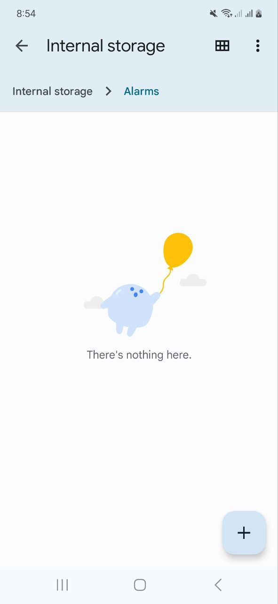