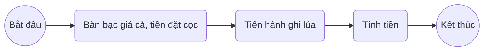
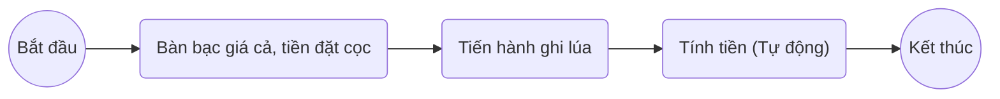
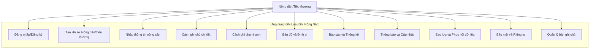
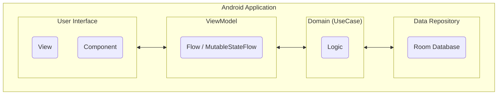
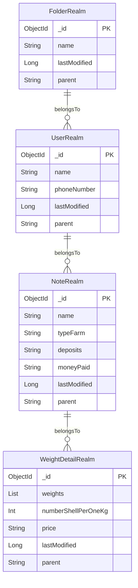
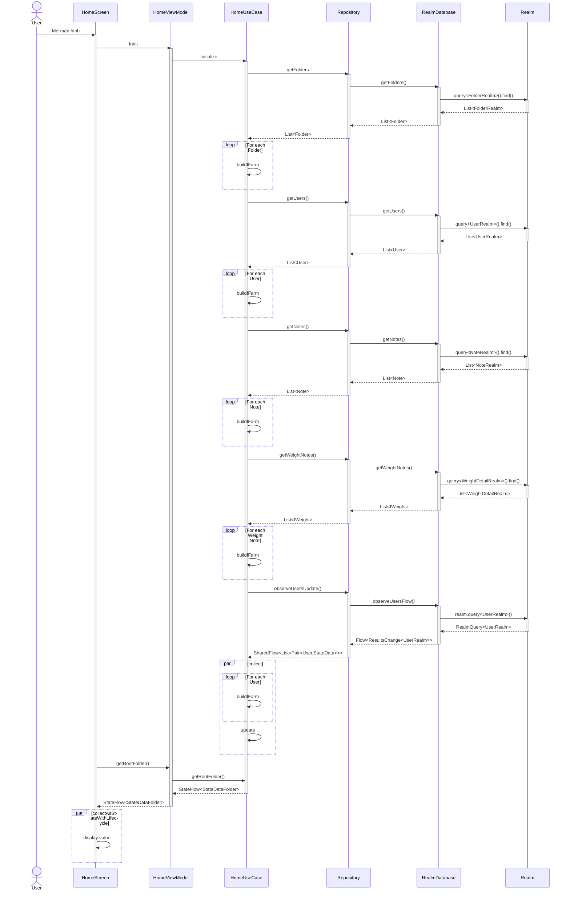
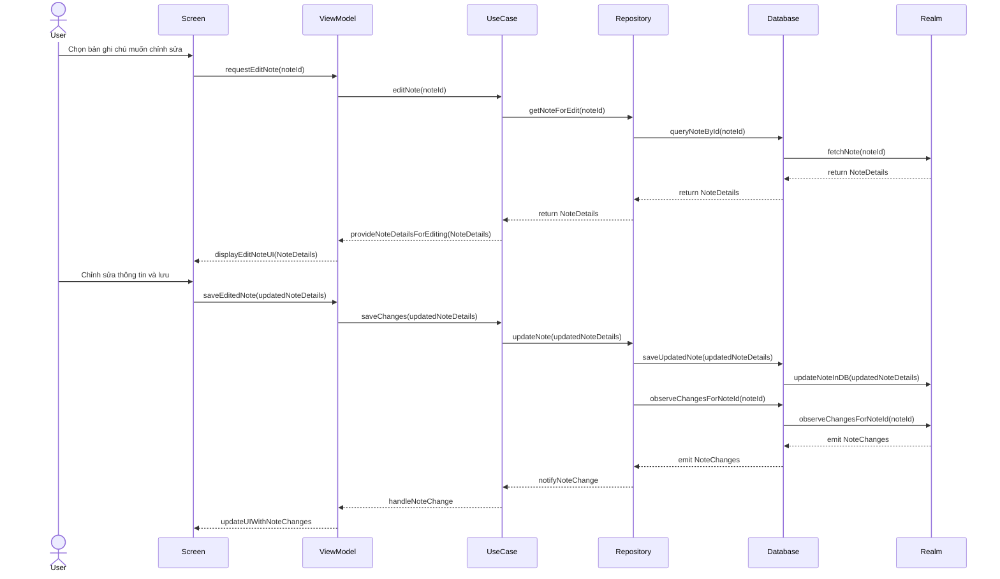
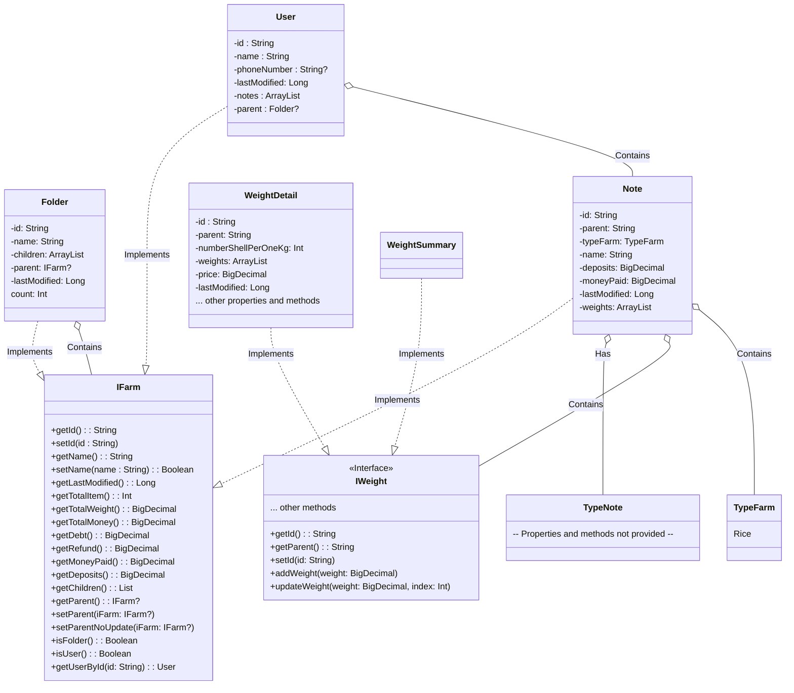

# Software Modeling

## Modeling business processes

- Ghi lúa thủ công

- Ghi lúa dùng ứng dụng

## User Requests

**1. Hồ sơ Nông dân/Tiêu thương**:
- Tạo hồ sơ cá nhân: tên, địa chỉ, số điện thoại, loại nông sản chính, phương thức thanh toán.

**2. Giao diện Đăng nhập/Đăng ký**:
- Xác thực thông tin cá nhân và bảo vệ dữ liệu ghi chú nông sản.

**3. Nhập thông tin nông sản**:
- Nhập: tên nông sản, loại, ngày thu hoạch, địa điểm thu hoạch.
- Chụp ảnh nông sản để đính kèm.

**4. Cách ghi chú chi tiết**:
- Nhập thông tin vào bảng chi tiết: khối lượng, giá, ghi chú.
- Tổng khối lượng và giá trị tự động.

**5. Cách ghi chú nhanh**:
- Nhập nhanh: tổng khối lượng và giá trị nông sản.

**6. Bản đồ và Định vị**:
- Hiển thị và ghi vị trí thu hoạch trên bản đồ.

**7. Báo cáo và Thống kê**:
- Xem báo cáo tổng hợp trong khoảng thời gian cụ thể.
- Biểu đồ và thống kê về mức thu hoạch và giá trị.

**8. Thông báo và Cập nhật**:
- Thông báo về giá nông sản, thời tiết, và thông tin quan trọng.

**9. Sao lưu và Phục hồi dữ liệu**:
- Sao lưu tự động và phục hồi dữ liệu.

**10. Bảo mật và Riêng tư**:
- Bảo vệ dữ liệu và không chia sẻ mà không có sự đồng ý của người dùng.

**11. Quản lý bản ghi chú**:
- **Xem danh sách bản ghi chú**: Cho phép người dùng xem tất cả các bản ghi chú mà họ đã thêm.
- **Chỉnh sửa bản ghi chú**: Người dùng có thể chọn một bản ghi chú cụ thể và chỉnh sửa thông tin trong đó.
- **Xoá bản ghi chú**: Cung cấp khả năng xoá bỏ một hoặc nhiều bản ghi chú đã chọn.
- **Tìm kiếm và lọc bản ghi chú**: Tích hợp công cụ tìm kiếm và lọc để người dùng có thể tìm nhanh chóng và dễ dàng các bản ghi chú theo tiêu chí nhất định.

## Modeling User Requirements

### Use case diagram

#### List of use case

| ID       | Tên                             | Mô tả ngắn                                                      |
|----------|---------------------------------|-----------------------------------------------------------------|
| UC - 001 | Đăng nhập/Đăng ký               | Cho phép người dùng đăng nhập hoặc tạo tài khoản mới            |
| UC - 002 | Tạo Hồ sơ Nông dân/Tiêu thương  | Tạo và cập nhật hồ sơ cá nhân cho người dùng                    |
| UC - 003 | Nhập thông tin nông sản         | Cho phép người dùng thêm thông tin về nông sản thu hoạch        |
| UC - 004 | Cách ghi chú chi tiết           | Nhập thông tin chi tiết về từng khối lượng nông sản             |
| UC - 005 | Cách ghi chú nhanh              | Nhập nhanh tổng khối lượng và giá trị nông sản                  |
| UC - 006 | Bản đồ và Định vị               | Xác định và hiển thị vị trí thu hoạch trên bản đồ               |
| UC - 007 | Báo cáo và Thống kê             | Xem báo cáo và thống kê khối lượng và giá trị nông sản          |
| UC - 008 | Thông báo và Cập nhật           | Nhận thông báo về giá nông sản, thời tiết, và cập nhật ứng dụng |
| UC - 009 | Sao lưu và Phục hồi dữ liệu     | Tự động sao lưu và phục hồi dữ liệu khi cần                     |
| UC - 010 | Bảo mật và Riêng tư             | Đảm bảo dữ liệu người dùng được bảo vệ                          |
| UC - 011 | Quản lý bản ghi chú             | Xem, chỉnh sửa, và xóa các bản ghi chú đã tạo                   |

#### Use case specification

1. Đăng nhập/ Đăng ký

| ID                       | UC - 001           |
|--------------------------|--------------------|
| **Tên**                  | Đăng nhập/ Đăng ký |
| **Mô tả ngắn**           |                    |
| **Người dùng**           |                    |
| **Luồng cơ bản**         |                    |
| **Luồng thay thế**       |                    |
| **Yêu cầu đặc biệt**     |                    |
| **Điều kiện tiên quyết** |                    |
| **Hậu điều kiện**        |                    |
| **Điểm mở rộng**         |                    |

2. Tạo Hồ sơ Nông dân/ Tiểu thương

| ID                       | UC - 002                        |
|--------------------------|---------------------------------|
| **Tên**                  | Tạo Hồ sơ Nông dân/ Tiểu thương |
| **Mô tả ngắn**           |                                 |
| **Người dùng**           |                                 |
| **Luồng cơ bản**         |                                 |
| **Luồng thay thế**       |                                 |
| **Yêu cầu đặc biệt**     |                                 |
| **Điều kiện tiên quyết** |                                 |
| **Hậu điều kiện**        |                                 |
| **Điểm mở rộng**         |                                 |

3. Nhập thông tin nông sản

| ID                       | UC - 003                 |
|--------------------------|--------------------------|
| **Tên**                  | Nhập thông tin nông sản  |
| **Mô tả ngắn**           |                          |
| **Người dùng**           |                          |
| **Luồng cơ bản**         |                          |
| **Luồng thay thế**       |                          |
| **Yêu cầu đặc biệt**     |                          |
| **Điều kiện tiên quyết** |                          |
| **Hậu điều kiện**        |                          |
| **Điểm mở rộng**         |                          |

4. Cách ghi chú chi tiết

| ID                       | UC - 004                                                                                                                                                                                                                                         |
|--------------------------|--------------------------------------------------------------------------------------------------------------------------------------------------------------------------------------------------------------------------------------------------|
| **Tên**                  | Cách ghi chú chi tiết                                                                                                                                                                                                                            |
| **Mô tả ngắn**           | Nhập thông tin chi tiết về từng khối lượng nông sản                                                                                                                                                                                              |
| **Người dùng**           | Nông dân/Tiêu thương                                                                                                                                                                                                                             |
| **Luồng cơ bản**         | 1. Người dùng chọn chức năng ghi chú chi tiết. 2. Hệ thống hiển thị bảng gồm 5x5 để nhập dữ liệu. 3. Người dùng nhập khối lượng cho từng rổ/bao. 4. Hệ thống tổng hợp và hiển thị khối lượng tổng cộng. 5. Người dùng lưu thông tin. |
| **Luồng thay thế**       | 3a. Nếu người dùng nhập dữ liệu không hợp lệ, hệ thống tự động bỏ qua lần nhập đó và không lưu dữ liệu vào hệ thống.                                                                                                                             |
| **Yêu cầu đặc biệt**     | - Hệ thống phải có khả năng kiểm tra định dạng dữ liệu đầu vào. - Hệ thống nên lưu dữ liệu tự động sau một khoảng thời gian ngắn để tránh mất mát dữ liệu.                                                                                    |
| **Điều kiện tiên quyết** | Người dùng đã đăng nhập và chọn khu vực nông sản cụ thể để nhập.                                                                                                                                                                                 |
| **Hậu điều kiện**        | Thông tin nông sản đã được cập nhật và lưu trong hệ thống.                                                                                                                                                                                       |
| **Điểm mở rộng**         | - Có khả năng xuất dữ liệu dưới dạng báo cáo PDF hoặc Excel. - Tích hợp tính năng scan QR code để tự động nhập dữ liệu từ các rổ/bao.                                                                                                         |

5. Cách ghi chú nhanh

| ID                       | UC - 005            |
|--------------------------|---------------------|
| **Tên**                  | Cách ghi chú nhanh  |
| **Mô tả ngắn**           |                     |
| **Người dùng**           |                     |
| **Luồng cơ bản**         |                     |
| **Luồng thay thế**       |                     |
| **Yêu cầu đặc biệt**     |                     |
| **Điều kiện tiên quyết** |                     |
| **Hậu điều kiện**        |                     |
| **Điểm mở rộng**         |                     |

6. Bản đồ và định vị

| ID                       | UC - 006           |
|--------------------------|--------------------|
| **Tên**                  | Bản đồ và định vị  |
| **Mô tả ngắn**           |                    |
| **Người dùng**           |                    |
| **Luồng cơ bản**         |                    |
| **Luồng thay thế**       |                    |
| **Yêu cầu đặc biệt**     |                    |
| **Điều kiện tiên quyết** |                    |
| **Hậu điều kiện**        |                    |
| **Điểm mở rộng**         |                    |

7. Báo cáo và thống kê

| ID                       | UC - 007             |
|--------------------------|----------------------|
| **Tên**                  | Báo cáo và thống kê  |
| **Mô tả ngắn**           |                      |
| **Người dùng**           |                      |
| **Luồng cơ bản**         |                      |
| **Luồng thay thế**       |                      |
| **Yêu cầu đặc biệt**     |                      |
| **Điều kiện tiên quyết** |                      |
| **Hậu điều kiện**        |                      |
| **Điểm mở rộng**         |                      |

8. Thông báo và cập nhật

| ID                       | UC - 008               |
|--------------------------|------------------------|
| **Tên**                  | Thông báo và cập nhật  |
| **Mô tả ngắn**           |                        |
| **Người dùng**           |                        |
| **Luồng cơ bản**         |                        |
| **Luồng thay thế**       |                        |
| **Yêu cầu đặc biệt**     |                        |
| **Điều kiện tiên quyết** |                        |
| **Hậu điều kiện**        |                        |
| **Điểm mở rộng**         |                        |

9. Sao lưu và phục hồi dữ liệu

| ID                       | UC - 009                     |
|--------------------------|------------------------------|
| **Tên**                  | Sao lưu và phục hồi dữ liệu  |
| **Mô tả ngắn**           |                              |
| **Người dùng**           |                              |
| **Luồng cơ bản**         |                              |
| **Luồng thay thế**       |                              |
| **Yêu cầu đặc biệt**     |                              |
| **Điều kiện tiên quyết** |                              |
| **Hậu điều kiện**        |                              |
| **Điểm mở rộng**         |                              |

10. Bảo mật và riêng tư

| ID                       | UC - 010             |
|--------------------------|----------------------|
| **Tên**                  | Bảo mật và riêng tư  |
| **Mô tả ngắn**           |                      |
| **Người dùng**           |                      |
| **Luồng cơ bản**         |                      |
| **Luồng thay thế**       |                      |
| **Yêu cầu đặc biệt**     |                      |
| **Điều kiện tiên quyết** |                      |
| **Hậu điều kiện**        |                      |
| **Điểm mở rộng**         |                      |

11. Quản lý bản ghi chú

| ID                       | UC - 011                                                                                                                                                                                                                                                                        |
|--------------------------|---------------------------------------------------------------------------------------------------------------------------------------------------------------------------------------------------------------------------------------------------------------------------------|
| **Tên**                  | Quản lý bản ghi chú                                                                                                                                                                                                                                                             |
| **Mô tả ngắn**           | Xem, chỉnh sửa, và xóa các bản ghi chú đã tạo                                                                                                                                                                                                                                   |
| **Người dùng**           | Nông dân/Tiêu thương                                                                                                                                                                                                                                                            |
| **Luồng cơ bản**         | 1. Người dùng truy cập mục "Quản lý bản ghi chú". 2. Hệ thống hiển thị danh sách các bản ghi chú. 3. Người dùng chọn một bản ghi để xem chi tiết. 4. Người dùng có thể chỉnh sửa hoặc xóa bản ghi chú. 5. Hệ thống cập nhật theo yêu cầu của người dùng và lưu lại. |
| **Luồng thay thế**       | 4a. Nếu người dùng chọn hủy bỏ: 1. Hệ thống không thực hiện thay đổi và quay trở lại danh sách.                                                                                                                                                                              |
| **Yêu cầu đặc biệt**     | - Hệ thống phải yêu cầu xác nhận trước khi xóa một bản ghi chú. - Hệ thống cần bảo vệ thông tin cá nhân và không cho phép truy cập không hợp lệ.                                                                                                                             |
| **Điều kiện tiên quyết** | Người dùng đã đăng nhập vào ứng dụng.                                                                                                                                                                                                                                           |
| **Hậu điều kiện**        | Dữ liệu trong hệ thống đã được cập nhật theo yêu cầu của người dùng.                                                                                                                                                                                                            |
| **Điểm mở rộng**         | - Tích hợp chức năng tìm kiếm để dễ dàng tìm bản ghi chú cần quản lý. - Cho phép người dùng xuất dữ liệu ra định dạng khác như PDF hoặc Excel.                                                                                                                               |

### User Story Map

| **Release**             | **Đăng Nhập/Đăng Ký** | **Thiết Lập Hồ Sơ**  | **Ghi Nông Sản** | **Quản Lý**             | **Cài Đặt & Bảo Mật** | **Thống Kê**             |
|-------------------------|-----------------------|----------------------|------------------|-------------------------|-----------------------|--------------------------|
| **Activities**          | Đăng ký & Đăng nhập   | Thiết lập thông tin  | Nhập nông sản    | Xem & Quản lý           | Sao lưu & Bảo mật     | Phân tích dữ liệu        |
| **User Stories (v1.0)** |                       |                      | - Nhập chi tiết  | - Xem bản ghi chú       |                       |                          |
|                         |                       |                      |                  | - Chỉnh sửa bản ghi chú |                       |                          |
|                         |                       |                      |                  | - Xoá bản ghi chú       |                       |                          |
|                         |                       |                      |                  | - Thêm bản ghi chú      |                       |                          |
| **User Stories (v2.0)** | - Tạo tài khoản mới   | - Tạo Hồ sơ          | - Nhập nhanh     |                         | - Sao lưu dữ liệu     | - Xem báo cáo tổng quan  |
|                         | - Đăng nhập ứng dụng  | - Cập nhật thông tin |                  |                         | - Thiết lập bảo mật   | - Xem biểu đồ khối lượng |

### User Story Description For MVP

| **Tiêu đề**        | Xem bản ghi chú                                                                                                                                                                         |
|--------------------|-----------------------------------------------------------------------------------------------------------------------------------------------------------------------------------------|
| **User story**     | Là một người dùng, tôi muốn có khả năng xem các bản ghi chú mà tôi đã tạo trước đó, để tôi có thể theo dõi, xem xét và kiểm tra lại các thông tin nông sản mà tôi đã nhập vào hệ thống. |
| **System provide** | - Hiển thị danh sách các bản ghi chú theo thứ tự thời gian, từ mới nhất đến cũ nhất.                                                                                                    | 
|                    | - Cho phép người dùng lọc và tìm kiếm bản ghi chú theo các tiêu chí như ngày, tên nông sản, hoặc khoảng thời gian cụ thể.                                                               |
|                    | - Hiển thị chi tiết của từng bản ghi chú khi người dùng chọn vào.                                                                                                                       |
|                    | - Cung cấp chế độ xem ở dạng lưới hoặc danh sách, tùy theo sở thích của người dùng.                                                                                                     |

| **Tiêu đề**        | Chỉnh sửa bản ghi chú                                                                                                                               |
|--------------------|-----------------------------------------------------------------------------------------------------------------------------------------------------|
| **User story**     | Là một người dùng, tôi muốn có khả năng chỉnh sửa các bản ghi chú mà tôi đã tạo trước đó.                                                           |
|                    | Điều này giúp tôi có thể cập nhật hoặc sửa đổi thông tin khi có sự thay đổi hoặc phát hiện sai sót.                                                 |
|                    | Tuỳ vào note đang ở dạng ghi chi tiết hay ghi nhanh tôi có thể chỉnh sửa thông số theo flow các dạng đó                                             |
| **System provide** | - Cung cấp danh sách bản ghi chú cho phép người dùng chọn bản ghi chú muốn chỉnh sửa.                                                               |
|                    | - Khi chọn một bản ghi chú, hệ thống sẽ tự động nhận diện dạng của bản ghi (ghi chi tiết hoặc ghi nhanh) và hiển thị giao diện chỉnh sửa tương ứng. |
|                    | - Cho phép người dùng chỉnh sửa thông tin trên các trường dữ liệu đã có và thêm/sửa thông tin mới.                                                  |
|                    | - Nút "Lưu" giúp người dùng lưu lại những thay đổi đã được thực hiện.                                                                               |
|                    | - Hiển thị thông báo xác nhận khi chỉnh sửa bản ghi chú thành công hoặc thông báo lỗi nếu có vấn đề xảy ra trong quá trình chỉnh sửa.               |
|                    | - Cung cấp tùy chọn hủy bỏ chỉnh sửa để người dùng có thể quay lại trạng thái ban đầu của bản ghi chú nếu muốn.                                     |

| **Tiêu đề**        | Xoá bản ghi chú                                                                                                             |
|--------------------|-----------------------------------------------------------------------------------------------------------------------------|
| **User story**     | Là người dùng, tôi muốn xoá bản ghi chú không cần thiết, để hệ thống chỉ lưu trữ thông tin phản ánh đúng tình hình của tôi. |
| **System provide** | - Cung cấp nút/tùy chọn "Xoá" ở mỗi bản ghi chú.                                                                            |
|                    | - Khi chọn "Xoá", hỏi xác nhận lại yêu cầu của người dùng.                                                                  |
|                    | - Thực hiện xoá nhanh chóng và cập nhật trạng thái bản ghi chú.                                                             |
|                    | - Thông báo thành công khi hoàn tất xoá hoặc hiện lỗi nếu có.                                                               |

| **Tiêu đề**        | Thêm bản ghi chú                                                                                                                                          |
|--------------------|-----------------------------------------------------------------------------------------------------------------------------------------------------------|
| **User story**     | Là nông dân/tiểu thương, tôi muốn thêm bản ghi chú mới với thông tin về nông sản. Tôi có thể ghi nông sản theo cách ghi chi tiết hoặc theo cách ghi nhanh.|
| **System provide** | - Tích hợp giao diện thân thiện giúp người dùng dễ dàng nhập chi tiết cho bản ghi chú mới, như: tên nông sản, ngày thu hoạch, khối lượng và thông tin khác.|
|                    | - Cung cấp tùy chọn cho phép người dùng tải lên hình ảnh hoặc các tệp đính kèm liên quan đến nông sản.                                                      |
|                    | - Tích hợp nút "Lưu" nổi bật, giúp người dùng lưu thông tin sau khi đã điền đầy đủ.                                                                       |
|                    | - Tự động thông báo xác nhận sau khi thêm bản ghi chú thành công hoặc cung cấp phản hồi lỗi rõ ràng nếu có sự cố trong quá trình nhập.                     |
|                    | - Tích hợp chức năng cho phép người dùng lựa chọn giữa cách ghi chi tiết hoặc ghi nhanh, tùy theo nhu cầu cụ thể.                                          |

| **Tiêu đề**        | Nhập bản ghi chi tiết                                                                                                                                                                                                                        |
|--------------------|----------------------------------------------------------------------------------------------------------------------------------------------------------------------------------------------------------------------------------------------|
| **User story**     | Là một Nông dân/Tiêu thương, tôi muốn nhập thông tin chi tiết về từng bao khối lượng nông sản trong một bảng 5x5, để tôi có thể theo dõi, cập nhật chính xác và tính toán tổng khối lượng cũng như tổng tiền cho từng bao nông sản của mình. |
| **System provide** | - Cung cấp giao diện nhập liệu với bảng 5x5 cho người dùng nhập khối lượng từng bao nông sản. Khi bảng đã được điền đầy, hệ thống tự động mở thêm bảng mới để tiếp tục nhập.                                                                 |
|                    | - Tích hợp tính năng kiểm tra dữ liệu: tự động báo lỗi và từ chối dữ liệu nhập vào nếu không phù hợp hoặc vượt quá giới hạn cho phép.                                                                                                        |
|                    | - Tính toán tự động và hiển thị tổng khối lượng và tổng giá trị của từng bao nông sản ngay sau khi người dùng hoàn tất việc nhập liệu.                                                                                                       |
|                    | - Sao lưu dữ liệu tự động sau mỗi khoảng thời gian cụ thể, đảm bảo rằng dữ liệu của người dùng không bị mất do bất kỳ sự cố bất ngờ nào.                                                                                                     |

### Architectural Models

### Data Modeling

### Sequence Diagram

1. Xem bản ghi chú

2. Chỉnh sửa bản ghi chú

3. Xoá bản ghi chú
4. Thêm bản ghi chú
5. Nhập bản ghi chi tiết

### Class Diagram

